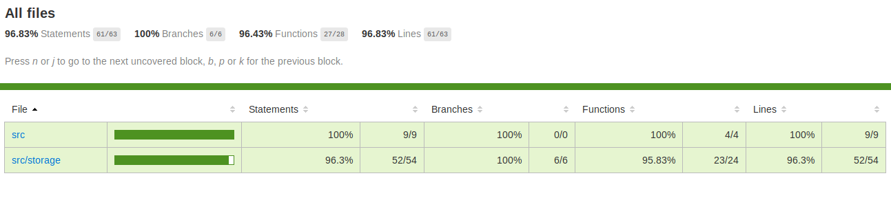
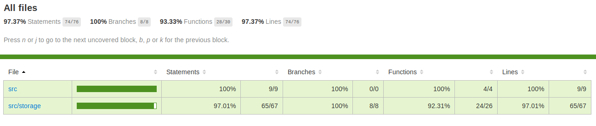

# Ejercicio 4 - Taller de testing en node

## Instalación

Clonar el repositorio con el proyecto

```
git clone --branch inicio https://github.com/bootcamp-testing-2019/ejercicio-4.git
```

Continuar con

* [Usando node](./node.md)
* [Usando Docker](./docker.md)


## Primera iteración

En esta primera iteración, luego de experimentar de manera concreta con varias variantes de posibles DSLs, implementamos el protocolo completo del DSL usando TDD.

Notar que no hay ningún test de unidad, únicamente tests usando el DSL que estamos diseñando.

Notar también que la cobertura de tests es de casi un 100% y que el único método que no se ejercita en los tests es un método de implementación.



Para generar el reporte de code coverage hacer

```
npx jest --coverage
```

## Segunda iteración

En la segunda iteración, luego de tener definida la interfaz pública del DSL, cambiamos completamente la implementación apoyándonos en el hecho de tener una cobertura de tests funcionales de casi el 100% y de no tener ningún test de unidad.




## Ejercicio completado

Para ver el ejercicio completado hacer

```
git checkout master
```

dentro del directorio `ejercicio-4`.

## Referencias

### Lenguaje

* [Node.js](https://nodejs.org/en/)

### Manejo de versiones de archivos

* [Git](https://git-scm.com/)
* [Github](https://github.com/)

### Versionado de librerías de node

* [npm](https://www.npmjs.com/)

### Testing

* [Jest framework](https://jestjs.io/)
* [Jest with Typescript](https://basarat.gitbooks.io/typescript/docs/testing/jest.html)

### Entornos

* [Docker](https://www.docker.com/)